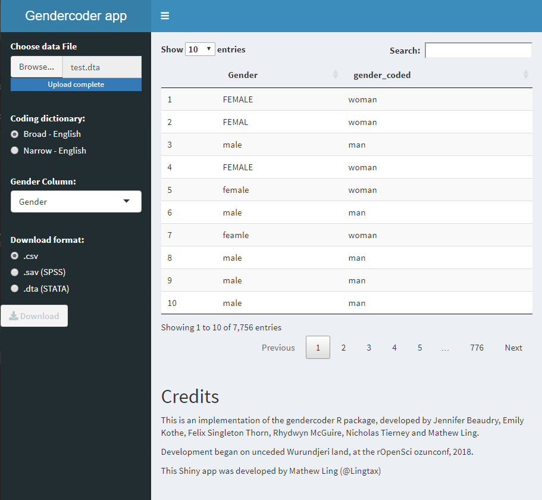

<!-- README.md is generated from README.Rmd. Please edit that file -->

# gendercoder

<!-- badges: start -->

[](https://CRAN.R-project.org/package=gendercoder)
[](https://lifecycle.r-lib.org/articles/stages.html#stable)
[](https://www.repostatus.org/#active)
[](https://github.com/ropenscilabs/gendercoder/actions)
[](https://github.com/ropenscilabs/gendercoder/actions)

<!-- badges: end -->

The goal of gendercoder is to allow simple re-coding of free-text gender
responses. This is intended to permit representation of gender
diversity, while managing troll-responses and the workload implications
of manual coding.

## Installation

This package is not on CRAN. To use this package please run the
following code:

``` r
devtools::install_github("ropenscilabs/gendercoder")
library(gendercoder)
```

## Basic use

The gendercoder package permits the efficient re-coding of free-text
gender responses within a tidyverse pipeline. It contains two in-built
English output dictionaries, a default `broad_en` dictionary which
corrects spelling and standardises terms while maintaining the diversity
of responses and a `narrow_en` dictionary which contains fewer gender
categories, “man”, “woman”, “boy”, “girl”, and “sex and gender diverse”.

The core function, `gender_recode()`, takes 3 arguments,

  - `gender` the vector of free-text gender,

  - `dictionary` the preferred dictionary, and

  - `fill` a logical indicating whether original values should be
    carried over if there is no match.

Basic usage is demonstrated below.

``` r
library(gendercoder)

tibble(gender = c("male", "MALE", "mle", "I am male", "femail", "female", "enby")) %>% 
  mutate(broad_gender  = recode_gender(gender, dictionary = broad_en, fill = TRUE),
         narrow_gender = recode_gender(gender, dictionary = narrow_en, fill = FALSE)
  )
#> 1 results not matched from the dictionary have been filled with the user inputted values
#> # A tibble: 7 x 3
#>   gender    broad_gender narrow_gender         
#>   <chr>     <chr>        <chr>                 
#> 1 male      man          man                   
#> 2 MALE      man          man                   
#> 3 mle       man          man                   
#> 4 I am male I am male    <NA>                  
#> 5 femail    woman        woman                 
#> 6 female    woman        woman                 
#> 7 enby      non-binary   sex and gender diverse
```

The package now also contains a shiny app for use of the
`gender_recode()` function by GUI. The app takes data in `.dta`, `.csv`,
and `.sav` formats.

To use the app, call the `gendercoder_app()` function.

``` r
gendercoder::gendercoder_app()
```



## Contributing to this package

This package is a reflection of cultural context of the package
contributors we welcome issues and pull requests to make the package
more inclusive and/or suitable for a broader range of cultural contexts.
We particularly welcome addition of non-English dictionaries or of other
genderdiverse responses to the broad\_en and narrow\_en dictionaries.

## Citation Information

Please cite this package as:

Jennifer Beaudry, Emily Kothe, Felix Singleton Thorn, Rhydwyn McGuire,
Nicholas Tierney and Mathew Ling (2020). gendercoder: Recodes Sex/Gender
Descriptions Into A Standard Set. R package version 0.0.0.9000.
<https://github.com/ropenscilabs/gendercoder>

## Acknowledgement of Country

We acknowledge the Wurundjeri people of the Kulin Nation as the
custodians of the land on which this package was developed and pay
respects to elders past, present and future.
